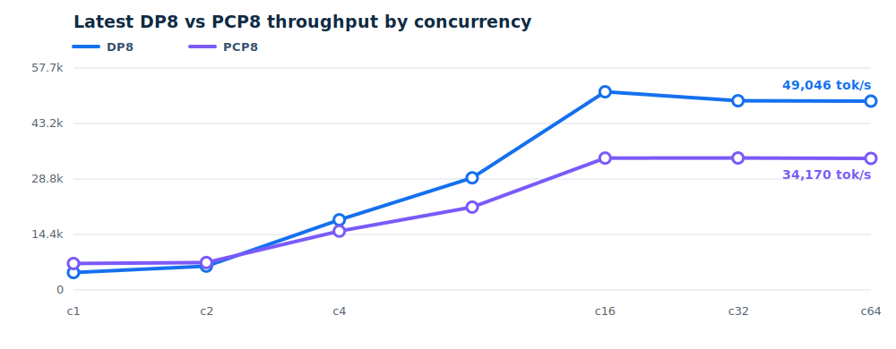
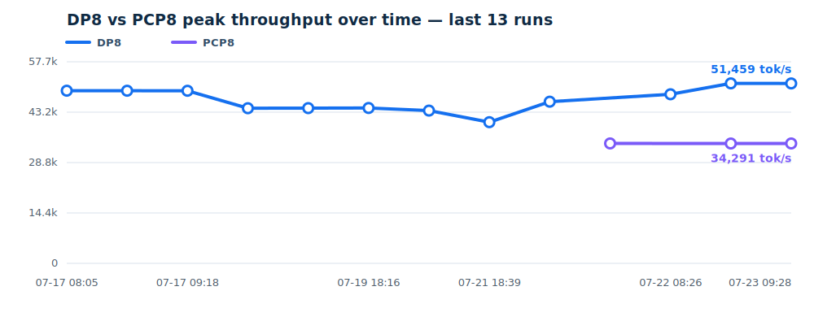

# TPU daily benchmark

This project runs a reproducible Qwen3.5-397B-A17B-FP8 throughput benchmark on
TorchTPU/vLLM. Model weights are replaced with vLLM dummy weights; the checked-in
`models/` directory contains only an offline configuration/tokenizer snapshot.

## Recent benchmark throughput

<!-- BENCHMARK_REPORT_START -->
Latest DP8 vs PCP8 throughput by concurrency:



Recent DP8 vs PCP8 peak throughput over time:



Latest successful DP8: **51,458.93 total tok/s** at concurrency **16** (`20260723T083433Z`).
Latest successful PCP8: **34,291.21 total tok/s** at concurrency **16** (`20260723T083433Z`).

| vllm-torchtpu commit | Test time (UTC) | DP peak prefill tok/s | PCP peak prefill tok/s | DP peak decode tok/s | DP min TPOT (ms) |
|---|---|---:|---:|---:|---:|
| `a03d8effc78a` | 2026-07-23 08:34 | 51,458.93 | 34,291.21 | 637.32 | 18.72 |
| `a03d8effc78a` | 2026-07-23 06:45 | 51,476.87 | 34,276.38 | 637.69 | 20.51 |
| — | 2026-07-22 08:15 | 48,359.05 | — | — | — |
| `db5ae0ab3941` | 2026-07-22 05:07 | — | 34,296.71 | — | — |
| `db5ae0ab3941` | 2026-07-22 01:40 | 46,240.26 | — | — | — |
| `db0149493e41` | 2026-07-21 18:00 | 40,378.43 | — | — | — |
| `a2bdc585f7f8` | 2026-07-20 18:00 | 43,690.58 | — | — | — |
| `d296ce153cdd` | 2026-07-19 18:00 | 44,436.44 | — | — | — |
| `d296ce153cdd` | 2026-07-18 18:00 | 44,397.93 | — | — | — |
| `2838d74ab880` | 2026-07-17 23:44 | 44,371.29 | — | — | — |

The charts compare the latest successful DP8 and PCP8 throughput across concurrency levels and track recent peak throughput over time; see [`reports/latest.json`](reports/latest.json) for the newest peaks and [`reports/throughput_history.json`](reports/throughput_history.json) for the full history.
<!-- BENCHMARK_REPORT_END -->

## Layout

- `third_party/torchtpu-vllm/`: `vllm-project/vllm-torchtpu` Git submodule,
  refreshed from `origin/main` (the local path is retained for compatibility).
- `models/`: offline model metadata; no checkpoint weights.
- `scripts/start_dp_server.sh`: starts the DP8/PCP1 vLLM server with dummy weights.
- `scripts/start_pcp_server.sh`: starts the DP1/PCP8 vLLM server with dummy weights.
- `scripts/bench_all.sh`: benchmarks input length 8192 at concurrency 1–64 for
  the configuration selected by `BENCHMARK_CONFIG`.
- `scripts/update_environment.sh`: updates `vllm-torchtpu`, installs its
  compatible `torch_tpu` wheel from Google Artifact Registry with pip, then
  synchronizes the rest of the project `.venv`.
- `scripts/daily_benchmark.sh`: complete locked cron workflow.
- `reports/`: durable peak-throughput history and generated SVG charts.
- `runs/`: timestamped logs, environment snapshots, and benchmark JSON files.

## First preparation

The machine needs `git`, `uv`, the Google Cloud CLI, and Python 3.12. SSH access
to GitHub is required for the `vllm-torchtpu` submodule. The active gcloud user
must have read access to the private `torch-tpu` Artifact Registry. Authenticate
that user before the first run:

```bash
gcloud auth login
gcloud auth list --filter=status:ACTIVE
```

The installer deliberately uses `gcloud auth print-access-token` instead of
Application Default Credentials because these can represent different users or
permissions. For non-gcloud automation, `TORCH_TPU_ACCESS_TOKEN` can provide a
short-lived token explicitly.

Run:

```bash
scripts/daily_benchmark.sh --prepare-only
```

Each invocation fetches the latest `vllm-torchtpu/main`, reads its exact
compatible `torch` and `torch-tpu` pins, and runs pip against the private
`torch-tpu` virtual registry. Installing the exact `torch` pin first is
intentional: `torch-tpu` alone has a broad dependency constraint that can select
a newer ABI-incompatible PyTorch build. The downloaded `torch-tpu` wheel is
force-reinstalled so a previous source-built wheel cannot remain in `.venv`.
The remaining dependencies are then synchronized with `uv`.

## Manual full run

```bash
scripts/daily_benchmark.sh
```

Before updating or building, the full workflow stops an existing vLLM API
server listening on `PORT` (18100 by default), including its worker process
group. A non-vLLM process on that port is never killed and causes the job to
fail safely. `--prepare-only` leaves any running service untouched.

The runner first starts DP8 and executes the decode and prefill suites, stops
that server, then starts PCP8 and executes the prefill suite only. The complete
run therefore contains three benchmark groups: DP8 decode, DP8 prefill, and
PCP8 prefill. Servers are stopped after the benchmark by default. Use
`--keep-server-running` only for interactive debugging; when successful, it
keeps the final PCP8 server alive.

The three benchmark groups share one run ID and one workflow start timestamp.
The homepage combines them into one table row and uses that shared start time
for `Test time (UTC)`.

After every successful full benchmark, the runner records the highest
`total_token_throughput` separately for DP8 and PCP8, regenerates the concurrency
and time-series SVG charts, then commits `README.md` and `reports/` once and
pushes that commit directly to `origin/main`. The GitHub repository homepage
therefore shows both charts without HTML or a separate web service. Set
`PUBLISH_REPORTS=0` to disable commit and push for a local-only run.

The most recent local DP8 and PCP8 peaks are available in `reports/latest.json`.
The generated images are `reports/throughput.svg` and
`reports/throughput_history.svg`; every successful report update replaces both
files atomically. Automatic publication uses the repository's configured Git
SSH credentials. It refuses to run when `main` differs from the remote, the
index is not empty, or unrelated project files are modified. The
`vllm-torchtpu` submodule pointer may be modified by its daily update, but it is
never included in the generated-report commit.

## Example crontab

Run every day at 02:00 UTC:

```cron
0 2 * * * /bin/bash /mnt/data/xiaohao/workspace/tpu_benchmark_daily/scripts/daily_benchmark.sh
```

The runner uses absolute project paths internally, takes an exclusive `flock`,
and writes all output beneath `runs/<UTC timestamp>/`. The exact
`vllm-torchtpu` revision, pip-installed `torch_tpu` version, and machine IP are
saved in each run's `run_metadata.json`. Set `MACHINE_IP` to override automatic
primary-address detection when the machine has multiple network interfaces.
