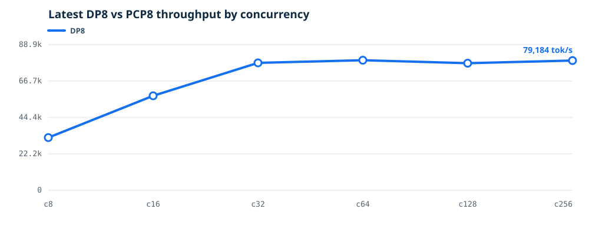
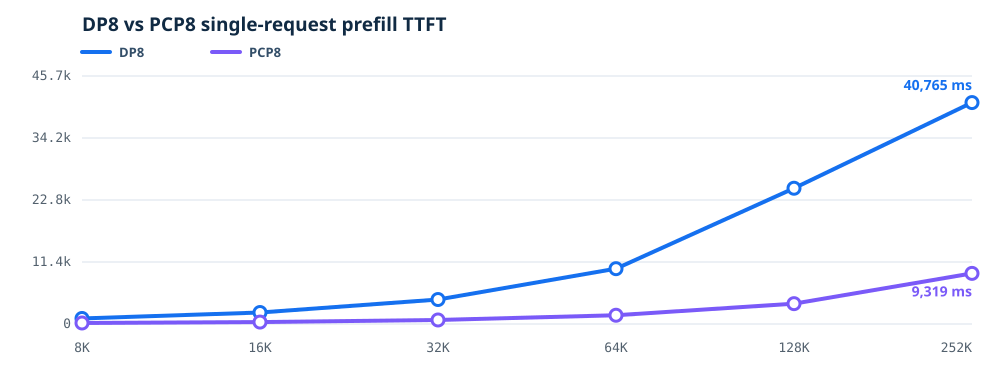
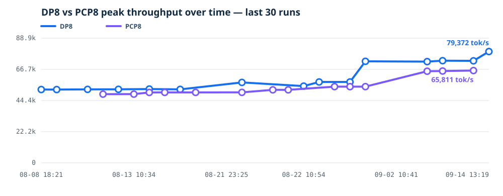
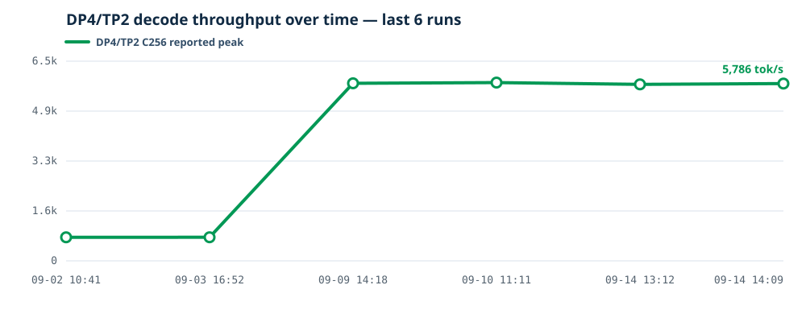

# TPU daily benchmark

## TL;DR

本项目每日顺序执行三组 Qwen3.5-397B-A17B-FP8 真实权重 benchmark：
TP1/DP8/EP8 C256 decode、DP8 prefill 和 PCP8 prefill。Decode 使用
C256/P65536/D1024、独立请求前缀、三轮 10 秒滑窗，按实际 peak-active
plateau 统计。DP8 和 PCP8 prefill 服务还分别测试并发度 1、输入长度
8K/16K/32K/64K/128K/252K、输出长度 1 的 TTFT；每档串行执行
16 条 measured requests，并展示 median TTFT。

DP8 和 PCP8 prefill 还会额外运行一组固定的真实语义变长请求：从公开的 NVIDIA
SPEED-Bench 快照的 4,194 条有效请求中，以 seed 42 全局随机选取 1,000 条；
移除人为长度填充并全局去重后，输入长度覆盖 756–37,719 tokens。该 workload
默认分别在并发度 8 和 64 下记录 input/total token 吞吐，以及相同负载下的
TTFT P50/P90/P99。

三组服务统一从项目内 `models/Qwen3.5-397B-A17B-FP8` 加载完整 checkpoint，
不再使用 `--load-format dummy`。由于真实权重与此前 dummy-weight 结果不可
直接比较，报告历史已从首轮真实权重测试 `20260728T012922Z` 重新开始。

## Recent benchmark throughput

<!-- BENCHMARK_REPORT_START -->
Latest DP8 vs PCP8 throughput by concurrency:



Latest DP8 vs PCP8 single-request prefill TTFT by input length:



Recent DP8 vs PCP8 peak throughput over time:



Recent DP8 decode throughput over time:



Latest DP8: **52,626.18 total tok/s** at concurrency **128** (`20260818T130726Z`).
Latest PCP8: **50,234.82 total tok/s** at concurrency **16** (`20260819T025246Z`).

Latest DP8 single-request TTFT: **success**, **16 serial samples/length** (`20260818T130726Z`).
Latest PCP8 single-request TTFT: **success**, **16 serial samples/length** (`20260819T025246Z`).

| vllm-torchtpu commit | Test time (UTC) | DP peak prefill tok/s | PCP peak prefill tok/s | DP decode tok/s | DP decode TPOT (ms) | Decode protocol | DP TTFT 8K (ms) | PCP TTFT 8K (ms) | DP TTFT 16K (ms) | PCP TTFT 16K (ms) | DP TTFT 32K (ms) | PCP TTFT 32K (ms) | DP TTFT 64K (ms) | PCP TTFT 64K (ms) | DP TTFT 128K (ms) | PCP TTFT 128K (ms) | DP TTFT 252K (ms) | PCP TTFT 252K (ms) |
| --- | --- | ---: | ---: | ---: | ---: | --- | ---: | ---: | ---: | ---: | ---: | ---: | ---: | ---: | ---: | ---: | ---: | ---: |
| `5bf2f0dbb8f4` | 2026-08-19 02:52 | — | 50,234.82 | — | — | — | — | 230.00 | — | 423.26 | — | 849.10 | — | 1,832.17 | — | 4,160.73 | — | 10,206.52 |
| `5bf2f0dbb8f4` | 2026-08-18 13:07 | 52,626.18 | 50,205.37 | 4,859.93 | 42.72 | C256 peak-active P50 | 1,042.81 | 225.28 | 2,153.17 | 444.39 | 4,554.71 | 839.05 | 10,207.26 | 1,808.38 | 24,774.53 | 4,145.35 | 65,283.82 | 10,177.04 |
| `2d40319a99b5` | 2026-08-13 10:05 | — | 49,004.40 | — | — | — | — | — | — | — | — | — | — | — | — | — | — | — |
| `2d40319a99b5` | 2026-08-13 09:30 | 52,442.02 | — | — | — | — | — | — | — | — | — | — | — | — | — | — | — | — |
| `1d733d447f75` | 2026-08-12 08:58 | — | 48,994.57 | — | — | — | — | 246.03 | — | 455.51 | — | 913.41 | — | 1,957.52 | — | 4,444.96 | — | 10,702.92 |
| `1d733d447f75` | 2026-08-12 07:39 | 52,400.11 | — | — | — | — | 1,048.24 | — | 2,161.25 | — | 4,595.86 | — | 10,276.45 | — | 24,854.46 | — | 65,390.41 | — |
| `140fd2f2249d` | 2026-08-12 05:10 | -1.00 | -1.00 | 4,867.20 | 42.67 | C256 peak-active P50 | failed | failed | failed | failed | failed | failed | failed | failed | failed | failed | failed | failed |
| `511d7905e67f` | 2026-08-09 16:00 | 52,263.67 | -1.00 | -1.00 | — | failed | 1,354.35 | failed | 2,770.05 | failed | 5,827.35 | failed | 12,727.54 | failed | 29,777.21 | failed | 75,109.10 | failed |
| `5d653d82c00a` | 2026-08-08 16:00 | 52,281.16 | -1.00 | 4,857.60 | 42.70 | C256 peak-active P50 | 1,353.02 | failed | 2,772.50 | failed | 5,816.20 | failed | 12,723.62 | failed | 29,788.14 | failed | 75,214.14 | failed |
| `de5bf42df46a` | 2026-08-08 00:02 | 52,267.53 | -1.00 | 4,865.70 | 42.67 | C256 peak-active P50 | 1,356.28 | failed | 2,778.97 | failed | 5,826.90 | failed | 12,711.26 | failed | 29,781.08 | failed | 75,149.21 | failed |

Failed benchmark groups are recorded as -1 tok/s in the table and JSON/CSV reports, while charts plot successful measurements only. The prefill charts compare DP8 and PCP8 throughput and track their recent peaks. The combined history table records each run's throughput and per-length median TTFT; missing measurements are shown as — and failed lengths as failed. The single-request TTFT chart uses concurrency 1, runs requests serially, and plots median latency to the first generated token across the completed samples. The decode chart keeps legacy peak-output and current peak-active P50 statistics in separate series; see [`reports/latest.json`](reports/latest.json) for the newest peaks and [`reports/throughput_history.json`](reports/throughput_history.json) for the full history.
<!-- BENCHMARK_REPORT_END -->

## Real variable-length prefill benchmark

<!-- SPEED_BENCH_REPORT_START -->
Latest PCP8 semantic mixed-length result: C8 **42,006.29 input tok/s**, TTFT P50/P90/P99 **2,023.11/2,901.97/3,787.07 ms**; C64 **45,695.11 input tok/s**, TTFT P50/P90/P99 **15,086.54/17,805.90/18,871.95 ms** (`20260819T025246Z`).

The latest recorded dataset contains **1000** requests from NVIDIA SPEED-Bench, ranging from **756** to **37,719** input tokens (SHA-256 `f16a7f760630…`). Each C8, C64 serving run reports both throughput and load TTFT.

Each result cell shows **input tok/s** followed by TTFT **P50/P90/P99** in milliseconds.

| vllm-torchtpu commit | Dataset SHA-256 | Test time (UTC) | DP C8 | DP C64 | PCP C8 | PCP C64 |
| --- | --- | --- | --- | --- | --- | --- |
| `5bf2f0dbb8f4` | `f16a7f760630` | 2026-08-19 03:44 | **28,037.09 tok/s**<br>P50/P90/P99: 2,428.35/6,141.95/9,609.36 ms | **48,415.13 tok/s**<br>P50/P90/P99: 13,223.08/21,084.02/31,084.44 ms | **42,006.29 tok/s**<br>P50/P90/P99: 2,023.11/2,901.97/3,787.07 ms | **45,695.11 tok/s**<br>P50/P90/P99: 15,086.54/17,805.90/18,871.95 ms |
| `1d733d447f75` | `f16a7f760630` | 2026-08-12 09:55 | **28,704.94 tok/s**<br>P50/P90/P99: 2,450.85/6,114.55/8,473.75 ms | **47,895.06 tok/s**<br>P50/P90/P99: 13,229.96/21,061.73/28,543.06 ms | **40,928.84 tok/s**<br>P50/P90/P99: 2,064.76/2,980.75/3,875.34 ms | **43,633.17 tok/s**<br>P50/P90/P99: 15,769.31/18,423.12/19,795.49 ms |
| `140fd2f2249d` | `f16a7f760630` | 2026-08-12 06:25 | **failed** | **failed** | **failed** | **failed** |
| `511d7905e67f` | `f16a7f760630` | 2026-08-09 17:38 | **25,122.62 tok/s**<br>P50/P90/P99: 2,777.66/6,952.95/9,692.67 ms | **48,522.63 tok/s**<br>P50/P90/P99: 13,461.70/20,483.24/26,253.51 ms | **failed** | **failed** |
| `5d653d82c00a` | `f16a7f760630` | 2026-08-08 18:21 | **25,676.38 tok/s**<br>P50/P90/P99: 2,696.79/6,910.02/9,794.52 ms | **48,141.07 tok/s**<br>P50/P90/P99: 13,509.16/21,039.05/27,120.53 ms | **failed** | **failed** |
| `de5bf42df46a` | `f16a7f760630` | 2026-08-08 02:25 | **25,253.28 tok/s**<br>P50/P90/P99: 2,792.99/6,916.22/9,729.80 ms | **48,662.37 tok/s**<br>P50/P90/P99: 13,655.26/20,274.94/25,793.72 ms | **failed** | **failed** |
| `70e84aba0e8f` | `f16a7f760630` | 2026-08-07 09:21 | **25,654.06 tok/s**<br>P50/P90/P99: 2,755.11/6,897.78/9,643.29 ms | **48,168.65 tok/s**<br>P50/P90/P99: 13,643.06/20,504.15/26,533.20 ms | **failed** | **failed** |
| `fc54f97ca64e` | `865ccc4fdc3e` | 2026-08-06 17:21 | **20,928.50 tok/s**<br>P50/P90/P99: 2,810.60/—/7,423.20 ms | — | — | — |
| `884a3154ca91` | `865ccc4fdc3e` | 2026-08-06 07:26 | — | — | **29,026.30 tok/s**<br>P50/P90/P99: 2,660.78/—/4,126.24 ms | — |
| `f53d6300e29f` | `865ccc4fdc3e` | 2026-08-06 06:25 | **18,611.18 tok/s**<br>P50/P90/P99: 3,150.07/—/7,416.52 ms | — | — | — |

Full machine-readable history is stored in [`reports/speed_bench_history.json`](reports/speed_bench_history.json) and [`reports/speed_bench_history.csv`](reports/speed_bench_history.csv).
<!-- SPEED_BENCH_REPORT_END -->

## Layout

- `third_party/torchtpu-vllm/`: `vllm-project/vllm-torchtpu` Git submodule,
  refreshed from `origin/main` (the local path is retained for compatibility).
- `models/`: offline model metadata and locally provisioned checkpoint weights;
  checkpoint files are excluded from Git.
- `scripts/start_dp_decode_server.sh`: starts the real-weight TP1/DP8/EP8
  C256 decode service with unified pool, auto-derived block size, GMU
  0.932285943, async scheduling, GDN v3, prefix cache disabled, and the same
  compile shapes as the current standalone C256 test；服务由
  `vllm-service-launch` 以 `role=decode` 托管。
- `scripts/start_prefill_server.sh`: shared real-weight prefill server launcher;
  `--config dp8` selects DP8/PCP1 and `--config pcp8` selects DP1/PCP8. Both
  use the unified pool with an auto-derived block size and are managed by
  `vllm-service-launch` with `role=prefill`.
- `scripts/start_dp_server.sh` and `scripts/start_pcp_server.sh`: compatibility
  wrappers that select the corresponding configuration in the shared launcher.
- `scripts/bench_all.sh`: benchmarks input length 8192 at concurrency 8–256 for
  the configuration selected by `BENCHMARK_CONFIG`.
- `scripts/bench_prefill_ttft.sh`: benchmarks 16 serial requests at concurrency
  1 for each input length from 8K–252K and writes an independent TTFT summary.
- `scripts/prepare_speed_bench_mix.py`: deterministically builds the checked-in
  1,000-request semantic mixed-length dataset from a raw SPEED-Bench snapshot.
- `scripts/bench_speed_bench_mix.sh`: runs the DP8/PCP8 semantic mixed-length
  concurrency sweep and validates throughput plus load-TTFT metrics from every
  raw vLLM result.
- `scripts/update_environment.sh`: updates `vllm-torchtpu`, installs its
  compatible `torch_tpu` wheel from Google Artifact Registry with pip, then
  synchronizes the rest of the project `.venv`.
- `vendor/vllm-service-launch/`: repository-owned service launcher runtime,
  systemd template, sudoers policy, and tmpfiles configuration.
- `scripts/install_vllm_service_launcher.sh`: installs the vendored launcher
  without requiring access to another source repository.
- `scripts/daily_benchmark.sh`: complete locked cron workflow.
- `reports/`: durable peak-throughput history and generated SVG charts.
- `runs/`: timestamped logs, environment snapshots, and benchmark JSON files.

## First preparation

机器需要安装 `git`、`uv`、Google Cloud CLI、Python 3.12 和 `sudo`。拉取 `vllm-torchtpu`
submodule 需要 GitHub SSH 权限；当前 gcloud 用户必须具有私有 `torch-tpu`
Artifact Registry 的读取权限。首次运行前先完成认证：

```bash
gcloud auth login
gcloud auth list --filter=status:ACTIVE
```

直接从本仓库在 benchmark 主机安装 launcher：

```bash
sudo scripts/install_vllm_service_launcher.sh
vllm-service-launch --help
```

完整 daily run 要求 `models/Qwen3.5-397B-A17B-FP8` 中存在真实模型权重。
权重文件由环境在本地提供并被 Git 忽略；`--prepare-only` 只执行
config/tokenizer 元数据检查，三个启动脚本加载服务时会由模型加载器验证
权重是否完整。

The installer deliberately uses `gcloud auth print-access-token` instead of
Application Default Credentials because these can represent different users or
permissions. For non-gcloud automation, `TORCH_TPU_ACCESS_TOKEN` can provide a
short-lived token explicitly.

Run:

```bash
scripts/daily_benchmark.sh --prepare-only
```

Each invocation fetches the latest `vllm-torchtpu/main`, reads its exact
compatible `torch` and `torch-tpu` pins, and runs pip against the private
`torch-tpu` virtual registry. Installing the exact `torch` pin first is
intentional: `torch-tpu` alone has a broad dependency constraint that can select
a newer ABI-incompatible PyTorch build. The downloaded `torch-tpu` wheel is
force-reinstalled so a previous source-built wheel cannot remain in `.venv`.
The remaining dependencies are then synchronized with `uv`.

## Manual full run

```bash
scripts/daily_benchmark.sh
```

All benchmark server configurations enable vLLM-TorchTPU's eight-rank bucket
precompile rotation by default to reduce cold-start compilation time. Set
`TPU_PARALLEL_PRECOMPILE=0` on the benchmark command to disable it for a
comparison run.

By default the runner tests the latest commit on `vllm-torchtpu/main`. To test
an exact commit instead, pass its Git commit ID:

```bash
scripts/daily_benchmark.sh --commit 0123456789abcdef0123456789abcdef01234567
```

`--commit` works with full runs, `--prepare-only`, and `--only`. A full
40-character commit ID is recommended; a 7–40 character short ID also works
when Git can resolve it locally or fetch it from the remote. The selected exact
revision is recorded in `run_metadata.json` and the generated report as usual.
Omitting `--commit` preserves the scheduled-job behavior of fetching the latest
`origin/main`.

To run only one benchmark group, use `--only`:

```bash
scripts/daily_benchmark.sh --only dp-decode
scripts/daily_benchmark.sh --only dp-prefill
scripts/daily_benchmark.sh --only pcp-prefill
```

DP8 and PCP8 prefill run both the 8K throughput sweep and the multi-length
single-request TTFT sweep by default. Use `--prefill-mode` to select only one:

```bash
# Run only the 8K concurrency/throughput sweep.
scripts/daily_benchmark.sh --only dp-prefill --prefill-mode throughput
scripts/daily_benchmark.sh --only pcp-prefill --prefill-mode throughput

# Run only the 8K–252K single-request TTFT sweep.
scripts/daily_benchmark.sh --only dp-prefill --prefill-mode ttft
scripts/daily_benchmark.sh --only pcp-prefill --prefill-mode ttft
```

`--prefill-mode all` is the default and preserves the existing behavior. The
mode applies to every selected prefill group, so a full run with
`--prefill-mode throughput` still runs DP decode but limits both DP8 and PCP8
prefill to their throughput sweeps. An explicitly supplied `--prefill-mode` is
rejected with `--only dp-decode` because that selection contains no prefill
benchmark.

Use `--prefill-workload` to choose the request set independently from the
measurement type:

```bash
# Run only the existing fixed 8K/multi-length-random prefill measurements.
scripts/daily_benchmark.sh --only dp-prefill --prefill-workload synthetic

# Run only the 1,000-request semantic mixed-length workload.
scripts/daily_benchmark.sh --only dp-prefill --prefill-workload speed-bench
scripts/daily_benchmark.sh --only pcp-prefill --prefill-workload speed-bench

# Combine workload and metric selectors.
scripts/daily_benchmark.sh --only dp-prefill \
  --prefill-workload speed-bench --prefill-mode throughput
```

`--prefill-workload all` is the default: both DP8 and PCP8 run the synthetic and
semantic workloads. The semantic dataset is committed as the gzip artifact
`datasets/speed_bench_mix/requests.jsonl.gz`; the runner verifies and expands it
inside the run directory before invoking vLLM. Its manifest records the source
snapshot revision, source-file hashes, final dataset hash, and exact token
lengths. Its results are kept separate from the fixed 8K history in
`reports/speed_bench_history.json` and `reports/speed_bench_history.csv`.
The mixed-length runner uses concurrency 8 and 64 by default; override the
space- or comma-separated `SPEED_BENCH_CONCURRENCIES` value to run a different
sweep. Each concurrency writes `throughput_c<concurrency>.json`, and the same
vLLM serving result supplies input/total throughput plus TTFT P50/P90/P99.
For this semantic workload, `--prefill-mode throughput` and
`--prefill-mode ttft` select the same serving calls because vLLM emits both
metric families from one request sweep; the mode remains recorded in metadata.

Use fixture-backed test mode to exercise result extraction and report rendering
without updating the environment, starting a server, sending requests, changing
durable reports, or publishing:

```bash
scripts/daily_benchmark.sh --test-only
```

The isolated preview is written beneath
`.state/test-only-preview/<timestamp>/project/`.
The fixture values are for parser and presentation validation only and must not
be treated as publishable benchmark measurements. The server scripts and both
fixed-prefill benchmark scripts, plus `bench_speed_bench_mix.sh`, also accept
`--test-only` directly. This mode covers
the DP8/PCP8 prefill paths; the C256 decode benchmark remains real-run only.
Set `TTFT_TEST_ONLY_FAILED_LENGTHS` to a space-separated subset of the configured
input lengths to preview partial-failure rendering. For example, this marks only
252K as failed while retaining the other fixture-backed DP8 measurements:

```bash
TTFT_TEST_ONLY_FAILED_LENGTHS=258048 \
  scripts/daily_benchmark.sh --test-only --only dp-prefill
```

Omitting `--only` preserves the full three-group workflow. A selective run
updates the environment in the same way as a full run, but validates and starts
only the service required by the selected benchmark. A prefill measurement
excluded by `--prefill-mode` is recorded as `not-run`, not as a failure. All
selections load the real checkpoint and therefore require complete weights in
the shared model directory.

Every selected benchmark group is reported and published unless
`PUBLISH_REPORTS=0`, including decode-only runs. A failed group records
throughput `-1`, does not prevent later selected groups from running, and still
participates in the final report publication. The runner returns a nonzero exit
status after publication when any selected group failed. TTFT input lengths are
handled independently: successful lengths remain visible, failed lengths are
shown as `failed`, and the TTFT chart plots only successful points. A partial
TTFT sweep does not stop the remaining lengths or the following PCP8 group, but
is counted as a failure in the final process status after reports are published.
With
`--keep-server-running`, the server for a fully successful selective run is kept.

更新或构建前，完整工作流会按稳定的 launcher service ID 停止上一次残留的
daily benchmark 服务。若其他进程占用 `PORT`（默认 18100），工作流不会主动
终止该进程，而是让 launcher 安全地返回启动失败。`--prepare-only` 不会修改
任何运行中的服务。

The runner first starts the real-weight DP8 C256 decode service, runs one
C8/P65536/D32 smoke process followed by three independent
C256/P65536/D1024 processes, and stops it. It then starts the real-weight DP8
and PCP8 services one at a time for their prefill suites. The complete run
therefore contains three benchmark groups: DP8 C256 decode, DP8 prefill, and
PCP8 prefill. Each group is isolated so a startup or benchmark failure is
recorded before the runner advances to the next group. The two prefill services
run their existing 8K concurrency sweep first and their single-request TTFT
sweep second, using 16 serial measured requests per input length. Servers are
stopped after the benchmark by default.
Use `--keep-server-running` only for interactive debugging; when successful,
it keeps the final PCP8 server alive.

The DP8 and PCP8 prefill launchers default to `--max-model-len 262144`.
The longest TTFT input is 258048 tokens (252K), leaving room for the one-token
output within the model's 262144-token context limit.

All three services use `models/Qwen3.5-397B-A17B-FP8` as their model
directory and load the real checkpoint from that directory with vLLM's default
automatic load format.

Decode 每条请求使用不同但可重复生成的自然语言前缀和独立 `cache_salt`，因此
不依赖 prefix cache 的跨请求复用；client 通过 `X-data-parallel-rank` 将
256 条请求按 `request_id % 8` 精确均分为每个 DP rank 32 条。请求直接并发
提交，不使用服务端 admission barrier。客户端通过 `requests.post(json=...)`
发起 streaming 请求，并从 cumulative `usage.completion_tokens` 展开 token
时间线。

若 256 条请求没有形成完整 10 秒重叠区间，各轮
`run_<N>/summary.json` 中的 `active_requests_max` 和
`timeline_valid_full_concurrency_decode` 会记录实际峰值并发，主吞吐取该峰值
并发平台窗口的 P50；主 TPOT 统计相同 peak-active 时间范围内的 token 间隔，
逐请求全生命周期 TPOT 作为补充。三轮结果均为独立 Python 进程，最终
`aggregate.json`/`aggregate.csv` 对每轮指标计算 `count`、`avg`、`min`、
`max`、sample `stddev`、`p90` 和 `p99`；daily 报告使用三轮
peak-active window throughput P50 的平均值，以及三轮 peak-active TPOT P50
的平均值。

三组测试的结果使用同级目录；两个 prefill 目录在根部提供 `summary.json`，
decode 目录保存 smoke、三轮独立 summary 及跨轮 aggregate：

```text
runs/<UTC timestamp>/results/
├── dp8_decode_c256/
│   ├── smoke/
│   │   └── summary.json
│   ├── run_1/
│   │   ├── summary.json
│   │   ├── timeline.csv
│   │   ├── request_tpot.csv
│   │   └── raw_requests.jsonl
│   ├── run_2/
│   │   └── ...
│   ├── run_3/
│   │   └── ...
│   ├── aggregate.json
│   └── aggregate.csv
├── dp8/
│   ├── summary.json
│   ├── single_request_ttft/
│   │   ├── summary.json
│   │   └── vllm_dp8_single_request_ttft_len*.json
│   └── vllm_dp8_tp1_len8192_c*.json
└── pcp8/
    ├── summary.json
    ├── single_request_ttft/
    │   ├── summary.json
    │   └── vllm_pcp8_single_request_ttft_len*.json
    └── vllm_pcp8_tp1_len8192_c*.json
```

Decode、DP8 prefill 和 PCP8 prefill 的原始摘要相互独立；报告生成器显式读取
`dp8_decode_c256/aggregate.json`，不会再把 decode 原始结果嵌套进
`dp8/summary.json`。

The three benchmark groups share one run ID and one workflow start timestamp.
The homepage combines them into one table row and uses that shared start time
for `Test time (UTC)`.

After all selected benchmark groups finish, the runner records the highest
`total_token_throughput` separately for successful DP8 and PCP8 groups and `-1`
for failed groups, regenerates the concurrency and time-series SVG charts, then
commits `README.md` and `reports/` once and pushes that commit directly to
`origin/main`. Failed values remain visible in the table and JSON/CSV reports,
while trend charts plot successful measurements only. Set `PUBLISH_REPORTS=0`
to disable commit and push for a local-only run.

The most recent local DP8 and PCP8 peaks are available in `reports/latest.json`.
The generated images are `reports/throughput.svg`,
`reports/throughput_history.svg`, and
`reports/decode_throughput_history.svg`. The latest length-vs-TTFT comparison is
`reports/prefill_ttft.svg`, with long-form history in
`reports/prefill_ttft_history.csv`; every successful report update replaces the
generated files atomically. Decode history renders the legacy
peak-output metric and the current C256 peak-active window P50 metric as
separate series because the two statistics are not directly comparable.
Automatic publication uses the repository's configured Git SSH credentials. It
refuses to run when `main` differs from the remote, the index is not empty, or
unrelated project files are modified. The `vllm-torchtpu` submodule pointer may
be modified by its daily update, but it is never included in the generated-report
commit.

## Example crontab

Run every day at 02:00 UTC:

```cron
0 2 * * * /bin/bash /mnt/data/xiaohao/workspace/tpu_benchmark_daily/scripts/daily_benchmark.sh
```

The runner uses absolute project paths internally, takes an exclusive `flock`,
and writes all output beneath `runs/<UTC timestamp>/`. The exact
`vllm-torchtpu` revision, pip-installed `torch_tpu` version, and machine IP are
saved in each run's `run_metadata.json`. Set `MACHINE_IP` to override automatic
primary-address detection when the machine has multiple network interfaces.
