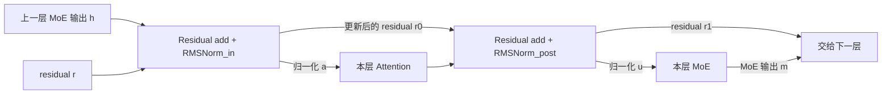
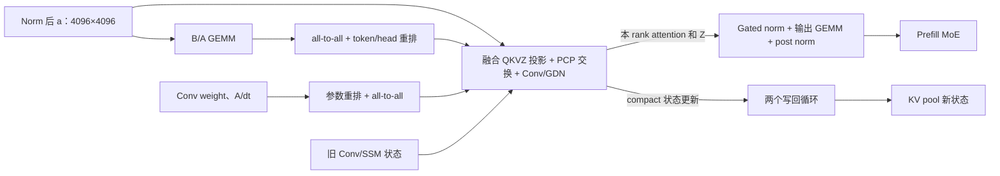
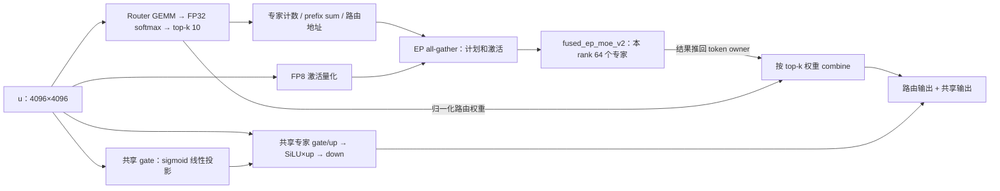
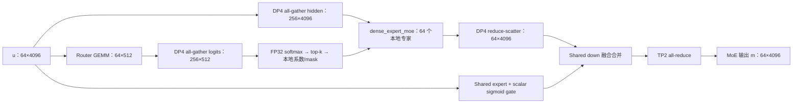

# 每层怎么算：Qwen3.5-397B 的编译后计算流

这份文档沿着**张量从哪里来、经过什么计算、送到哪里**来读。模型、版本和采样条件沿用[采集报告](README.md)。下面使用实际 codegen HLO 的算子名；附表的依赖边直接从 HLO operands 提取，不按 profiler 时间戳猜执行顺序。

每个框/表格行表示一次有意义的张量变换，可能对应几个 fusion；Pallas 内部融合的运算写在同一行，不拆成独立 kernel。<1 µs 的小事件不单列，但其数学作用不会从计算关系中删除。通信按整体调用表示，不把短 start/done 当作通信本身。

## 60 层怎么对应

| 层号，从 0 开始 | 层类型 | 下面采用的代表层 |
|---|---|---|
| `4k, 4k+1, 4k+2`，`k=0…14` | GDN，共 45 层 | layer 1 |
| `4k+3`，`k=0…14` | Full attention，共 15 层 | layer 3 |

各层都包括 attention 和 MoE。具体 fusion 后缀、首尾层 residual 处理及跨层融合可能不同，不把 layer 1/3 的名字复制成其他层的实际名字。

| 本 rank 的逻辑维度 | DP8 / PCP8 prefill | DP4/TP2 decode |
|---|---|---|
| 编译图 token 数 `T` | 4096；PCP 组共 32768 | 64；DP gather 后 256 |
| hidden `H` | 4096 | 4096 |
| GDN Q/K heads；V/Z heads | 16；64，head dim 128 | 8；32，head dim 128 |
| Full-attention Q heads；KV heads | 32；2，head dim 256 | 16；1，head dim 256 |
| 本地 routed experts | 64，intermediate 1024 | 64，intermediate 1024 |
| 本地 shared expert intermediate | 1024 | 512 |

表中的 shape 是逻辑视图；物理 blocked shape 和 dtype 见每节链接的逐算子依赖表。

## 一层的入口与出口

逻辑上，vLLM 传递的是 hidden 和 residual 两条数据：

数学关系是 `r0=h+r → a=RMSNorm(r0) → r1=r0+Attention(a) → u=RMSNorm(r1) → m=MoE(u)`；第一层没有传入 residual 时取 `r0=h`。编译器可能把 residual 加法、均方归约融合进前一个 GEMM，所以不能在已包含这些操作的 fusion 后再加一次。

## 1. DP8 prefill — GDN 层

主链：`输入归一化 → QKVZ / B,A 两个投影分支 → Conv+GDN → gated RMSNorm → 输出投影 → post norm → prefill MoE`。

| 输入 | 计算与实际编译实现（layer 1） | 输出 / 去向 |
|---|---|---|
| hidden、residual、norm weight | 输入 RMSNorm 与动态 FP8 量化；`abs_reduce_fusion.177`、`clamp_convert_fusion.132`，scale 保护融在邻近短操作中 | BF16 `a[T,H]`；FP8 `a8[T,H]` 与行 scale |
| `a8`、QKVZ weight/scale | QKVZ GEMM：`multiply_convert_fusion.43` | BF16 `[T,20480]`；拆成 Q/K 各 `[T,16,128]`、V/Z 各 `[T,64,128]` |
| BF16 `a`、B/A weight | B/A GEMM：`bitcast_convert_fusion.57` | 两组 `[T,64]` 门控；准备为 FP32 接口 |
| Q/K/V、B/A、Conv/SSM 旧状态 | `slice_convert_fusion.43` 等准备 QKV；`fused_conv1d_gdn_per_seq.91` 内完成 Conv1D、SiLU、Q/K 归一化、衰减/更新门和 GDN 递推 | BF16 attention `[T,64,128]`；更新 Conv/SSM 状态 |
| attention 输出、Z、gated-norm weight | head 内 RMSNorm，再乘 `SiLU(Z)`，准备输出 GEMM 的 FP8 激活；`fusion.4`、`abs_reduce_fusion.58`、`fusion.256` | FP8 `[T,8192]` 与行 scale |
| 上述激活、输出 weight、residual | 输出 GEMM及 residual/归约：`multiply_reduce_fusion.117`；post norm 的其余部分由 `abs_reduce_fusion.176` 等完成 | BF16 `u[T,4096]`，送入[Prefill MoE](#prefill-moe)；residual `r1` 向下一层传递 |

GDN state 是 BF16 Conv state + FP32 SSM state。纯 prefill 的 batched/decode 空路径不足 1 µs，不画成主计算步骤。QKVZ 输出通往 GDN 和 Z gate 两条分支，不能把 Z 当作 Conv 输入。

[逐算子依赖：DP8 GDN](flows/dp8-gdn.md)

## 2. DP8 prefill — Full-attention 层

主链：`输入归一化 → Q/gate/K/V 投影 → Q/K norm + RoPE → FP8 KV → 分页 attention → sigmoid gate → 输出投影 → post norm → prefill MoE`。

| 输入 | 计算与实际编译实现（layer 3） | 输出 / 去向 |
|---|---|---|
| hidden、residual | 输入 norm + FP8 量化：`abs_reduce_fusion.173`、`clamp_convert_fusion.128` | FP8 `[T,H]` 与行 scale |
| FP8 hidden、投影权重 | `multiply_convert_fusion.59` | BF16 `[T,17408]`：Q 8192、output gate 8192、K 512、V 512 |
| Q、K、head norm weights、位置 cos/sin | Q/K RMSNorm：`fusion.556`、`fusion.12`、`multiply_add_fusion.225/.14`；RoPE：`multiply_subtract_fusion.14` 等 | Q `[T,32,256]`、K `[T,2,256]`；只旋转每 head 的 64 维。V 不做 Q/K norm |
| K、V、KV scale | FP8 KV 转换与打包：`select_convert_fusion.89`、`pad_maximum_fusion.15`；V 的转换部分已与邻近归约融合 | FP8 K/V，物理接口打包为 `[T,2,512]` |
| Q、新 KV、历史 KV pool、block table | `RPAm-p128-b1-q256-k256.45`：分页 KV 读写、QKᵀ、causal softmax、PV | attention `[T,32,256]`；KV pool 更新 |
| attention、output gate | 乘 `sigmoid(gate)` 并量化：`abs_reduce_fusion.56`、`bitcast_convert_fusion.14`、`clamp_convert_fusion.14` | FP8 `[T,8192]` 与 scale |
| 上述激活、输出 weight、residual | `multiply_reduce_fusion.113`、`abs_reduce_fusion.172` 等 | BF16 `u[T,H]` → [Prefill MoE](#prefill-moe) |

`RPAd-p128-b8-q1-k1536.45` 也有 ≥1 µs 的调用记录，但本轮没有有效 decode 请求；它在混合图中保留，与有效 prefill 计算区分。

[逐算子依赖：DP8 Full attention](flows/dp8-full-attention.md)

## 3. PCP8 prefill — GDN 层

这里有**主输出、状态写回**两条后续路径，不能排成一个简单的串行列表。

| 输入 | 计算与实际编译实现（layer 1） | 输出 / 去向 |
|---|---|---|
| hidden、residual | `multiply_add_fusion.133`，输入 RMSNorm | BF16 `a[4096,H]` |
| `a`、B/A weight | `fusion.3439` → `all_to_all.347` → `scatter_custom_fusion.10`、`fusion.3367` | 从 token-local `[4096,128]` 变成 32768 tokens × 本地 8 个 value heads 的 B/A；FP32 接口再 pad 到 128 |
| Conv weight、A/dt 参数 | 权重/参数整理 → `all_to_all.357/.358/.359` | 融合 kernel 所需的 head-local 参数；不是激活的 TP all-reduce |
| `a`、QKVZ weight/scale、上述门控/参数、旧状态 | `fused_pcp_qkvz_projection_gdn_per_seq_compact_qkv_c256_p8_pooled.91` | 融合投影、PCP 交换、Conv/GDN；返回 token-local attention/Z 及 compact 状态更新。中间 head-local 视图为 `[32768,8,128]`，token-local 视图为 `[4096,8,8,128]` |
| compact Conv/SSM 更新、活动 slot、KV pool | `while.3717/.3718` 内的条件写回及 `bitcast_dynamic-update-slice_fusion.2/.3` | 新 Conv/SSM 状态，供后续请求/模型步使用；不是 MoE 的输入张量 |
| token-local attention、Z | `multiply_reduce_fusion.43`、`abs_reduce_fusion.58`、`clamp_convert_fusion.58` | gated RMSNorm 后的 FP8 `[4096,8192]` |
| FP8 输出激活、输出权重、residual | `multiply_reduce_fusion.162`、`abs_reduce_fusion.133` 等 | BF16 `u[4096,H]` → [Prefill MoE](#prefill-moe) |

这里没有额外画一个独立的 QKVZ GEMM：它已经在融合 PCP GDN kernel 内。短的 Conv 权重切片重排不逐个画框，其结果仍作为参数交换的输入。

[逐算子依赖：PCP8 GDN](flows/pcp8-gdn.md)

## 4. PCP8 prefill — Full-attention 层

输入投影、Q/K norm、RoPE 和 output gate 与 DP8 的逻辑相同；**attention 主体换成 current/history 两段**。

| 输入 | 计算与实际编译实现（layer 3） | 输出 / 去向 |
|---|---|---|
| hidden、residual、投影权重 | norm/量化 → `multiply_convert_fusion.14` | Q/gate/K/V，合计 `[4096,17408]` |
| Q、K、V、位置 | Q/K norm + RoPE + KV FP8，代表为 `multiply_add_fusion.225/.14`、`multiply_subtract_fusion.14`、`select_convert_fusion.89` | 本 rank Q 与新 KV |
| Q、新 KV、PCP 调度 | `pcp_streaming_attention_current_state_page_groups_multi_head.45`，沿 ring 消费当前片段 KV，执行 causal attention | FP32 online-softmax 状态 `m/l/acc`；捕获要存入本 rank 的 KV |
| 捕获的 KV、slot/page 地址 | `pcp_write_captured_kv_to_local_cache.45` | 更新本地分页 KV pool |
| Q、`m/l/acc`、历史 KV pool | `pcp_streaming_attention_history_output_page_groups_multi_head.45`，沿 ring 消费历史 KV | 有历史请求的 attention 输出 |
| 当前片段的 `m/l/acc` | `pcp_streaming_attention_zero_history_output_multi_head.45` | 无历史请求的归一化输出 |
| 两条输出、请求历史标志 | `broadcast_select_fusion.21` | 选择得到 `[4096,32,256]` 的逻辑 attention 输出 |
| attention、output gate、输出权重、residual | gate/量化 → `multiply_reduce_fusion.158` → post norm | BF16 `u[4096,H]` → [Prefill MoE](#prefill-moe) |

history 分支承接 current 的 softmax 累积状态；不是两个独立 attention 输出相加。零历史分支与 history 分支的输出按请求选择。

[逐算子依赖：PCP8 Full attention](flows/pcp8-full-attention.md)

## 5. 四种 prefill 层共用的 MoE 计算流

输入都是本 rank BF16 `u[4096,4096]`。Router 与 shared expert 读取同一个 `u`，两条分支在最后汇合；它们可在 trace 中交错出现。

| 数据关系 | 实际计算 / 代表编译名 | 输出 |
|---|---|---|
| `u → logits → probabilities → top-k` | BF16 Router GEMM；FP32 softmax 的归约/exp/除法；Pallas top-k | logits/probabilities `[4096,512]`，top-k weights/IDs `[4096,10]` |
| top-k IDs → dispatch plan | histogram、prefix sum、scatter/gather、专家/目标 rank 的行起点与地址；包括 `convert_reduce_fusion.*`、`select_reduce_fusion.*` 等多个编译算子，不能视为一个融合 kernel | INT32 路由/传输表 |
| `u → FP8 u8` | 动态量化与有效 token mask，例如 DP8 layer 1 的 `fusion.497` | 本 rank 4096 个 token 的 FP8 激活及 scale |
| 本地 plan、`u8` → EP all-gather | 计划 all-gather 与激活 all-gather 分开；EP8 收集后激活物理视图为 `[32768,32,128]` | 本地专家要处理的 token 和路由表 |
| gathered tokens + 本地专家权重 → expert output | `fused_ep_moe_v2_g64_c128_nb3.*`：gate/up GEMM → SiLU×up → down GEMM；内部把结果推回 token owner | token owner 可读取的专家输出 slab 与量化 scale |
| slab + top-k weights → routed output | `select_multiply_fusion.*` 等准备权重；`moe_v2_combine_t4096_k10_b64.*` 取回、反量化、加权求和 | BF16 `[4096,H]` |
| `u → shared gate/up → SiLU×up → shared down` | FP8 gate/up GEMM，BF16 `[4096,2048]`；激活后 `[4096,1024]` 再量化；FP8 down GEMM | shared output `[4096,H]`，乘独立 scalar sigmoid gate |
| routed output + gated shared output | 加法已与 shared down 或邻近 norm 计算融合 | MoE 输出 `m[4096,H]`；下一层继续 residual/norm |

四种层的实际核心名字：

| 层 | Router | top-k | Expert / combine 后缀 | Shared gate/up；down/合并 |
|---|---|---|---|---|
| DP8 GDN | `fusion.3142` | `shard_map.181` | `.181` / `.181` | `multiply_convert_fusion.358`；`multiply_reduce_fusion.116` |
| DP8 Full attention | `fusion.3144` | `shard_map.183` | `.183` / `.183` | `multiply_convert_fusion.356`；`multiply_reduce_fusion.112` |
| PCP8 GDN | `fusion.3379` | `shard_map.273` | `.181` / `.181` | `multiply_convert_fusion.313`；`multiply_reduce_fusion.161` |
| PCP8 Full attention | `fusion.3381` | `shard_map.275` | `.183` / `.183` | `multiply_convert_fusion.311`；`multiply_reduce_fusion.157` |

## 6. DP4/TP2 decode — GDN 层

这一步每个请求只新增一个 token，`T=64`。与 prefill 相比，主要 GDN 调用切到 batched，输出投影后还要 TP 归约。

| 输入 | 计算与实际编译实现（layer 1） | 输出 / 去向 |
|---|---|---|
| hidden、residual | `abs_reduce_fusion.177` → `compare_select_fusion.301` → `clamp_convert_fusion.132` | BF16 norm 后 hidden；FP8 `[64,H]` 和行 scale |
| FP8 hidden、QKVZ weight | `fusion.46` | BF16 `[64,10240]`：Q/K 各 1024、V/Z 各 4096 |
| BF16 hidden、B/A weight | `fusion.1994` → `fusion.1990` → `pad_convert_fusion.87/.86` | B/A 各 `[64,32]`，接口转 FP32 并 pad |
| Q/K/V、B/A、旧状态 | QKV 准备 `slice_convert_fusion.43`；`fused_conv1d_gdn_batched.91` | BF16 `[64,32,128]`；本 TP rank 的 Conv/SSM 状态更新 |
| attention、Z、gated-norm weight | `fusion.784`、`add_rsqrt_fusion.58`、`abs_reduce_fusion.58`、`fusion.1038` 等 | gated RMSNorm 后 FP8 `[64,4096]` |
| FP8 激活、输出权重 | 输出 GEMM `fusion.301` → TP all-reduce `.370` | attention 完整输出 `[64,H]`；合并两份 TP head 贡献 |
| attention 输出、residual | `multiply_reduce_fusion.117` → `add_rsqrt_fusion.192` → `abs_reduce_fusion.176` | BF16 `u[64,H]` → [Decode MoE](#decode-moe) |

混合图仍调用 `fused_conv1d_gdn_per_seq.91`，本轮没有有效 prefill 序列。逐算子依赖表保留它在 batched 输出/状态之后的实际位置，但不把它解释成第二次有效 GDN 计算。

[逐算子依赖：Decode GDN](flows/decode-gdn.md)

## 7. DP4/TP2 decode — Full-attention 层

| 输入 | 计算与实际编译实现（layer 3） | 输出 / 去向 |
|---|---|---|
| hidden、residual、投影权重 | norm/量化 → `fusion.119` | BF16 `[64,8704]`：Q/gate 各 4096、K/V 各 256 |
| Q/K、norm weights、位置 | Q/K RMSNorm + RoPE；`multiply_add_fusion.165/.128`、`multiply_subtract_fusion.14` 等 | Q `[64,16,256]`、K `[64,1,256]` |
| K、V、KV scale | FP8 转换/打包；`fusion.1673`、`select_convert_fusion.29`、`pad_maximum_fusion.15` | FP8 新 KV，接口 `[64,1,512]` |
| Q、新 KV、长历史 KV pool | `RPAd-snh-p128-b8-q1-k3328.45` | 单 token 分页 attention，输出逻辑 `[64,16,256]`；KV pool 更新 |
| attention、output gate | sigmoid gate + FP8 量化；`abs_reduce_fusion.56`、`compare_select_fusion.292`、`clamp_convert_fusion.127` | FP8 `[64,4096]` |
| FP8 激活、输出权重 | `fusion.303` → TP all-reduce `.378` | 完整 attention 输出 `[64,H]` |
| attention 输出、residual | residual + post RMSNorm；`multiply_reduce_fusion.113`、`add_rsqrt_fusion.187`、`abs_reduce_fusion.172` | BF16 `u[64,H]` → [Decode MoE](#decode-moe) |

`RPAm-snh-p128-b2-q256-k256.45` 是混合图保留的多 token 调用，本次无有效 prefill 工作。

[逐算子依赖：Decode Full attention](flows/decode-full-attention.md)

## 8. 两种 decode 层共用的 MoE 计算流

| 输入 → 输出 | 实际算子（GDN layer 1；Full-attention layer 3） | 为什么有这一步 |
|---|---|---|
| `u[64,H] → logits[64,512]` | `fusion.1995`；`fusion.1998` | 本地 Router BF16 GEMM |
| logits / hidden → 256-token 的 logits / hidden | GDN `all-gather.125/.127`；FA `.133/.135`，分别取完整逻辑调用 | 同 TP rank 的 DP4 组收齐 token；不是 EP8 收集 8 份重复 token |
| logits → FP32 softmax → top-k | GDN `fusion.1333/.1332` → `router_topk.121`；FA `fusion.1329/.1328` → `router_topk.123` | 得到 `[256,10]` 的权重和全局专家 ID |
| top-k → 本地专家系数和 active mask | 归一化、减本地专家起点、拆列、匹配累加；GDN `subtract_select_fusion.58`、`compare_reduce_fusion.58`；FA 后缀 `.56` | `[256,64]` 系数与 64 个专家的 active mask；接口系数 pad 到 `[256,128]` |
| gathered hidden + 系数 + expert weights → 本地专家贡献 | `dense_expert_moe-e_64-m_256-h_4096-i_1024-buffers_3.241/.243` | 不按专家重排 token；内部完成 FP8 gate/up、SiLU×up、down、加权 FP32 累加，输出 BF16 `[256,H]` |
| `[256,H] → 本 DP rank [64,H]` | DP reduce-scatter `.243`；`.247` | 合并同 TP rank 的 DP 组专家贡献并取回本地 token |
| `u → shared gate/up → SiLU×up → down` | GDN `fusion.541`、`clamp_convert_fusion.193`、`fusion.477`；FA `fusion.543`、`clamp_convert_fusion.191`、`fusion.473` | TP2 每 rank 的 shared intermediate 为 512；独立 scalar gate 分别为 `fusion.776/.770` |
| routed partial + gated shared partial → 完整 MoE 输出 | 合并已在 shared down fusion 中；TP all-reduce `.372`；`.380` | 最后合并另一 TP rank 的专家贡献与共享专家部分输出；不能在 DP reduce-scatter 后就认为结果完整 |

DP groups 为 `{{0,4,6,2},{1,5,7,3}}`，TP groups 为 `{{0,1},{2,3},{4,5},{6,7}}`。TP all-reduce 后邻近的 residual/norm 归约可能属于下一层的输入准备。

## 从总览查到某一个实际算子

例如 Decode GDN 的依赖表里：`N03 norm/统计量 → N04 scale → N05 FP8 convert → N06 QKVZ GEMM`；B/A 分支从 `N03` 分出，最终与 QKV 在 GDN 调用汇合。这是真实 HLO producer-consumer 关系，不是四条相邻的 profiler 事件。

六份依赖表覆盖保留的计算、布局和完整通信节点；状态写回循环作为复合节点，表内列出实际循环体算子及观测次数。模型输入、权重、缓存、跨层共享准备作为边界输入。原始 CSV、完整 HLO 校验值和采样记录仍在[证据报告](README.md)中。

[依赖验证记录](flow-validation.json)：742 条算子连接均已沿最终 HLO 的 operands 校验。
