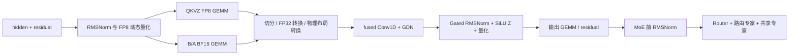
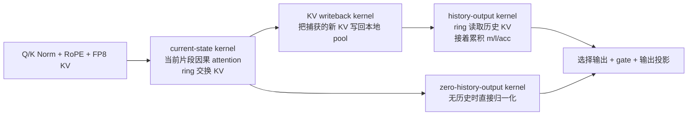
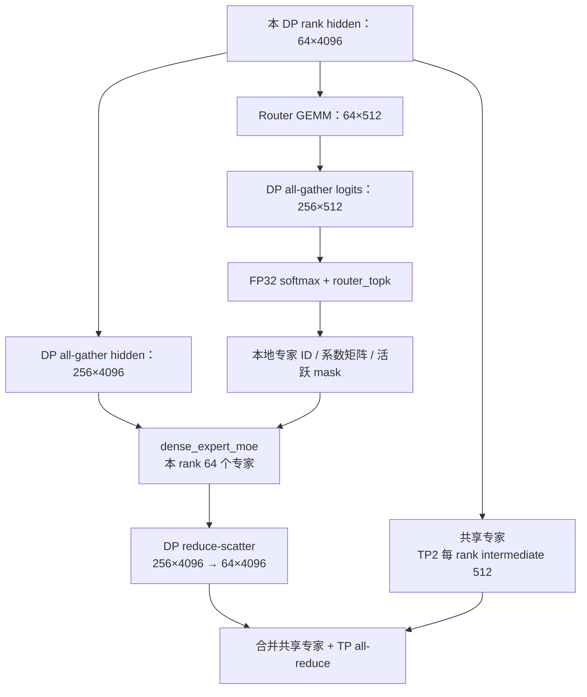

# Qwen3.5-397B：prefill / decode 的编译后单层算子

**先读：[每层怎么算——计算流总览](COMPUTE-FLOWS.md)**。按三种配置分别说明 GDN 和 full-attention 的输入、算子、分支、通信及输出，并附六份从最终 HLO 提取的 producer-consumer 依赖表。本文与 CSV 用于查采集证据。

采集对象是 `tpu_benchmark_daily` 当前默认模型 **Qwen3.5-397B-A17B-FP8**，不是 Qwen3.8。模型位于 `/mnt/data/models/qwen3.5-397B-A17B-fp8`。

**三组均已完成：DP8 prefill、PCP8 prefill、DP4/TP2 decode。清单均以真实设备 trace 和最终 codegen HLO 为依据。本次服务已停止，8 个 TPU 设备已释放。**

先看三个区别：DP8 prefill 使用独立 QKVZ 投影和 GDN；PCP8 把 QKVZ 投影与 PCP GDN 融合，但仍有外部状态写回；decode 使用小 batch dense-expert MoE，通信也与 prefill 的 fused EP MoE 不同。

## 怎么读

先看下面的计算链，再查逐条 CSV。清单来自真实请求的 TPU XPlane 记录，并逐名匹配 `after_codegen.txt`；源码只用于解释含义。没有把 PyTorch 的每一行当作一个算子。

这里的粒度是编译后的 fusion、Pallas kernel、collective 和设备搬运事件。Pallas 内部的 MXU/向量指令不逐条拆分；表格解释其融合计算，不能将解释中的多个数学步骤算作多个独立 launch。

- 一个融合 kernel 可能同时完成 GEMM、缩放、residual add，甚至下一次 RMSNorm 的部分归约。这些步骤不能再当作几个独立 kernel 计数。
- 原始 CSV 同时保留计算、实际 copy/布局物化、DMA 和异步边界；正文链接默认展示 ≥1 µs 的关注清单。`copy-start/copy-done` 是同一次 DMA 的两端，TensorCore 发起异步调用与 SparseCore 执行也不能重复计费。
- 纯形状视图、被消除的操作，没有设备事件就不列为独立执行算子。
- GDN 与 full attention 不同，分别选 **layer 1** 和 **layer 3**，层号从 0 开始。这个模型每四层是 3 个 GDN 加 1 个 full attention，共 60 层。

## 默认筛选：只关注 ≥1 µs 的事件

下面正文中的逐条清单默认筛除 `duration_us < 1` 的事件，原始清单仍完整归档。阈值使用采集中的设备事件时长，不是 XProf 的默认显示过滤器。

按单 rank、单个完整模型步，取 GDN layer 1 和 full-attention layer 3：

| 配置 | GDN 计算/索引事件 ≥1 µs | Full-attention 计算/索引事件 ≥1 µs | GDN 全类别事件 ≥1 µs | Full-attention 全类别事件 ≥1 µs |
|---|---:|---:|---:|---:|
| DP8 prefill | 53 | 57 | 80 | 96 |
| PCP8 prefill | 67 | 64 | 117 | 98 |
| DP4/TP2 decode | 48 | 54 | 64 | 69 |

“计算/索引事件”统计 TensorCore `XLA Ops` 中的 fusion、实际 Pallas 调用及独立 convert、slice、broadcast、reduce、pad、reduce-window、dynamic-slice、add、concatenate、dynamic-update-slice；排除 ConcatBitcast、copy/reshape、通信、控制边界。SparseCore 和其他类别保留在“全类别事件”中。**这些数字不是独立 kernel launch 数，也不是画面中肉眼可见的大块数量。**

筛选仅用于确定优化关注范围，不代表这些短事件没有执行。所选层中被过滤事件的时长之和：

| 配置 | GDN 被过滤事件 | 时长之和（µs） | Full-attention 被过滤事件 | 时长之和（µs） |
|---|---:|---:|---:|---:|
| DP8 prefill | 208 | 23.570 | 188 | 22.696 |
| PCP8 prefill | 287 | 36.211 | 193 | 22.080 |
| DP4/TP2 decode | 73 | 19.444 | 18 | 1.310 |

上述和可能包含嵌套、重叠及异步边界，不能当作层的墙钟时间或预计可优化收益。PCP 的跨层共享清单另有 4,301 条被过滤事件，时长之和为 1,776.301 µs；保留累计统计，避免只看单次时长而漏掉大量重复操作。

[筛选规则、各清单行数、被过滤事件累计时长及原始文件校验值](event-filter-summary.json)

## 运行范围

| 项目 | 本次值 |
|---|---|
| daily 版本 | `8c366c2b08f0cea9a8868a51487e66c4d5b020e3` |
| daily 固定的 torchtpu-vllm 子模块 | `9bfea3dee1282e36db69bd3a5fce37b2aa7abdfc` |
| vLLM / torch-tpu | `0.29.0+empty` / `0.1.1.dev20260912075415` |
| Prefill 部署 | DP8/TP1/EP8；另采 PCP8/DP1/TP1/EP8 |
| Decode 部署 | DP4/TP2/EP8 |
| Prefill 采集请求 | C8，输入 8192 token、输出 1 token；先预热，再采 3 轮 |
| Decode 采集请求 | daily 的 C256、输入 65536、输出 1024；采样开始时各 DP rank 有 64 个活跃请求，全部完成 prefill |
| 额外操作 | 启用 HLO 导出和 profiler；保留原 daily 算子/并行配置 |

启动命令与版本见各目录的 `launch.json`，实际请求数和完成状态见 `capture-complete.json`、`requests.jsonl`。这次目的为识别执行算子，不把带 profiler 的单次耗时作为性能 benchmark。

## 先理解 shape

`T` 表示编译图中的本 rank token 数，包含 padding。DP8 采样图的 `T=4096`，不等于一次请求的总输入长度 8192。

| 部分 | TP1 逻辑 shape / 参数 | 作用 |
|---|---|---|
| hidden | `[T,4096]` | 层的输入/输出 |
| GDN Q、K | 各 `[T,16,128]` | 线性注意力的查询/键 |
| GDN V、Z | 各 `[T,64,128]` | 值与输出 gate |
| GDN QKVZ 投影 | `4096 → 20480` | 一次投影生成上述四部分 |
| GDN B/A 投影 | `4096 → 128` | 每个 value head 的更新/衰减门 |
| GDN Conv | 12288 通道，kernel size 4 | 对 Q/K/V 做短程因果混合 |
| GDN SSM | 每序列 `[64,128,128]`，FP32 | 保存压缩的历史状态 |
| Full-attention Q | `[T,32,256]` | 32 个 query heads |
| Full-attention K/V | 各 `[T,2,256]` | GQA 的 2 个 KV heads |
| Full-attention 输入投影 | `4096 → 17408` | Q 8192 + 输出 gate 8192 + K 512 + V 512 |
| Attention 输出投影 | `8192 → 4096` | 把 head 输出合回 hidden |
| Router | `4096 → 512`，top-k 10 | 为每个 token 选专家 |
| Routed experts | 512 个；EP8 每 rank 64 个；intermediate 1024 | 稀疏 FFN |
| Shared expert | intermediate 1024，另有 `4096 → 1` gate | 每个 token 都执行的共享 FFN |

运行时 Linear 权重已从 checkpoint 的 block scale 格式重整为 per-channel FP8，HLO 中可见一维 FP32 scale；不要拿 checkpoint scale 的 shape 直接解释 GEMM 接口。

## DP8 prefill：GDN 层实际做什么

| 实际 kernel / fusion 例子（layer 1） | 做什么；为什么存在 |
|---|---|
| `abs_reduce_fusion.*`、`compare_select_fusion.*`、`clamp_convert_fusion.*` | 将归一化后的激活按行量化：计算 `max(abs(x))/448`，处理全零行，再缩放、clip、转 FP8。部分归一化或门控会融入这些 kernel。 |
| `multiply_convert_fusion.43` | FP8 QKVZ GEMM，输出 BF16 `[4096,20480]`；同时应用 scale。 |
| `bitcast_convert_fusion.57` | B/A BF16 GEMM，生成两组 64-head gate。 |
| `slice_convert_fusion.43`、`pad_convert_fusion.43` | 切出 QKV / gate，转换为 GDN 接口需要的 FP32，并补齐布局。 |
| `fused_conv1d_gdn_batched.91` | 单 token 路径。混合执行图保留这个调用；本轮输出只要 1 token，没有实际 decode 请求。仍可看到很短的调用事件。 |
| `fused_conv1d_gdn_per_seq.91` | 本轮 prefill 的主要 GDN kernel：Conv1D、SiLU、Q/K 归一化、门控 Delta 计算及状态读写融合执行。没有单独的 PyTorch Conv1D/attention kernel 列表。 |
| FP32 convert、mean/rsqrt、门控与量化 fusion | 对 GDN 输出做 gated RMSNorm，乘 `SiLU(Z)`，为输出 GEMM 准备激活。融合边界按 HLO 而非 Python 函数划分。 |
| `multiply_reduce_fusion.117` | attention 输出投影到 `[4096,4096]`，编译器同时融合 residual 或后续归一化的部分工作。 |

**状态 dtype 要分开看：**统一 KV pool 的 HLO 容器可能显示 `f8e4m3fn[...]`，GDN 在其中保存的是 **BF16 Conv state + FP32 SSM state 的原始字节**；不能据此认为 SSM 被量化成了 FP8。

## DP8 prefill：full-attention 层实际做什么

| 实际 kernel / fusion 例子（layer 3） | 做什么；为什么存在 |
|---|---|
| RMSNorm、动态 FP8 量化 fusion | 归一化 hidden，并为输入投影生成 FP8 激活和 scale。 |
| `multiply_convert_fusion.59` | 输入 GEMM，生成 Q、K、V 和输出 gate，共 17408 通道。 |
| Q/K RMSNorm 与 RoPE fusion | 对每个 head 归一化，再旋转位置相关的维度；head_dim 256，rotary 部分为 64。 |
| `select_convert_fusion.89`、`pad_maximum_fusion.15` | K/V 转 FP8，拼接/补齐到 RPA 输入布局。KV 量化位于 RPA 调用之前。 |
| `RPAd-p128-b8-q1-k1536.45` | 单 token RPA 路径；本轮纯 prefill 的有效 decode 数为零，但调用边界仍在图里。 |
| `RPAm-p128-b1-q256-k256.45` | 本轮主要 RPA kernel，更新/读取分页 KV，融合 QKᵀ、因果 mask、softmax 和 PV。 |
| gate 与输出 GEMM fusion | attention 输出乘 sigmoid gate，再通过 `multiply_reduce_fusion.113` 投影回 hidden；可同时处理 residual/归一化归约。 |

RPA 名称的 `p` 是 kernel page size，`b` 是 kernel batch tile，`q/k` 是 query/KV tile。它们不是用户请求并发数，也不一定等于 vLLM 管理层的 cache block size。本轮管理层 block size 为 4224，kernel page 为 128。

`rpa_metadata_schedule.*`、位置索引/cos/sin 准备等存在多层复用；它们在共享事件清单中单列。

## PCP8 prefill 与 DP8 哪些地方不同

选用真实 trace 中 `T=4096/rank`、全 PCP 组最多 32768 tokens 的图。这里并非把 DP8 的算子原样复制到 8 个 rank。

### GDN：投影并入核心 kernel，但外围工作仍然存在

| 编译后实际事件 | 含义 |
|---|---|
| `constant_dynamic-update-slice_fusion.*` | 重排 Conv 权重的 Q/K/V 通道；在本轮执行中可见，不能当作已全部移到加载阶段。 |
| `all_to_all.*` | 交换 B/A 的 token/head 分片，以及 Conv 权重、A/dt 等小参数的 head shard。layer 1 中可见 4 个 all-to-all 本体，另有对应控制/搬运事件。 |
| scatter、slice、stack 等 fusion | 把 rank-major token 顺序还原为 GDN 所需的 request/head 顺序。 |
| `fused_pcp_qkvz_projection_gdn_per_seq_compact_qkv_c256_p8_pooled.91` | 融合 QKVZ 投影、PCP 交换、Conv1D/GDN 计算及输出交换，返回本 rank 的 token-local 输出、Z 和 compact 状态更新。DP8 的独立 QKVZ GEMM 与两个 GDN 核心调用，在这里变成此路径。 |
| `while.3717` / `while.3718` 及实际执行的 `conditional`、`dynamic-update-slice` | 分别把 compact Conv/SSM 更新写回统一 KV pool 的活动序列 slot。这部分在上述融合 kernel 外部，不能漏列。 |
| Gated RMSNorm、输出投影、MoE | 继续处理 token-local 输出，整体功能与 DP8 相同；具体 fusion、copy 和布局不同。 |

### Full attention：当前片段和历史 KV 分开处理

实际名字分别为：

1. `pcp_streaming_attention_current_state_page_groups_multi_head.45`：当前片段的 causal pass，产生 FP32 online-softmax 状态 `m/l/acc`，同时捕获要写回的 KV。
2. `pcp_write_captured_kv_to_local_cache.45`：把新 KV 放入本 rank 的分页缓存。
3. `pcp_streaming_attention_history_output_page_groups_multi_head.45`：继续消费历史 KV，输出 `acc/l`。
4. `pcp_streaming_attention_zero_history_output_multi_head.45`：处理无历史 KV 的请求。
5. `broadcast_select_fusion.21`：选择各请求对应的输出。

四个 Pallas 调用都出现在 trace 中；是否有有效工作量取决于该批请求的历史长度。KV 在 PCP rank 间按 page 分片，沿 ring 传输所需 page，不要求每个 rank 先收齐完整 KV cache。

PCP 还有多层复用的调度构造，包括实际的 `while`、sort、prefix sum 和索引 kernel。逐条保留在共享清单中，循环内重复执行的事件也保留，没有仅按 HLO 静态名字去重后假装每次只执行一次。

- [PCP GDN layer 1：逐条事件与含义](pcp8/analysis/layers/layer-1-events-ge-1us.csv)
- [PCP full-attention layer 3：逐条事件与含义](pcp8/analysis/layers/layer-3-events-ge-1us.csv)
- [PCP 共享调度/入口事件](pcp8/analysis/layers/layer--1-events-ge-1us.csv.gz)
- [PCP trace 完整性检查](pcp8/analysis/validation.json)

PCP 的 TorchTPU/Kineto 转换曾提示 100 万事件上限。本报告直接读取原始 XPlane：其中 5 段 4096-token 图，每段都包含 45 个 GDN、15 个 full-attention（每层四个核心调用）和 60 个 MoE；所选段的 26,695 条 TensorCore/SparseCore 事件名称均匹配最终 HLO。其他 token bucket 不混入该单层清单。

## Prefill 两类层共用的 MoE：不只是两个 GEMM

| 执行环节 | 实际设备工作 |
|---|---|
| Router GEMM | `fusion.3142` / `fusion.3144`：BF16 hidden × router weight，产生 512 个 logits。 |
| 分数与 top-k | FP32 softmax 的归约/exp/归一化 fusion；`shard_map.181` / `.183` 的 Pallas top-k 返回 10 个权重和专家 ID。 |
| 路由计划 | histogram、前缀和、scatter/gather、整数除法/取模/位移、padding：生成专家行起点、目标 rank、slab 地址和传输表。CSV 逐条保留这些辅助 kernel。 |
| 两类 all-gather | 收集 FP8 token 激活；另收集整数路由表、FP32 scale 的位表示和计数。不能把 EP 的全部通信都归入 fused MoE kernel。 |
| 专家计算与返回 | `fused_ep_moe_v2_g64_c128_nb3.*`：本 rank 的 64 个专家，融合 gate/up GEMM、SiLU×up、down GEMM，并将结果推送回 token 所属 rank。 |
| Top-k 合并 | `moe_v2_combine_t4096_k10_b64.*`：取回专家结果，反量化、乘路由权重并求和，得到 BF16 `[4096,4096]`。 |
| Shared expert | 单独的 gate/up GEMM、SiLU×up、down GEMM；另计算 sigmoid scalar gate，控制共享专家贡献，再与 routed 结果相加。 |

共享专家与路由计划可以交错执行。CSV 按 trace 时间排序，不能假设实际执行顺序和上表的解释顺序完全相同。

## DP4/TP2 decode：实际执行链

采集前先让全部 256 个长输入完成 prefill。每个 DP rank 有 64 个活跃请求，所选编译图为 **64-token bucket**，不是 4096-token prefill 图。8 个预热请求及 256 个正式请求均正常完成；正式请求的实际 usage 全部为输入 65536、输出 1024。

TP2 使本 rank 的 GDN Q/K heads 变成 8、V/Z heads 变成 32；full-attention Q heads 为 16、KV head 为 1。层输入仍是 `[64,4096]`，本次实际图没有把 token 维度按 TP2 分成 32。

### Attention：decode 路径有有效工作，prefill 路径仍保留调用

| 部分 | 编译后实际调用 | 含义 |
|---|---|---|
| GDN 输入投影 | `fusion.46` | FP8 GEMM，得到 BF16 `[64,10240]` 的 Q/K/V/Z。 |
| GDN B/A 投影 | `fusion.1994` 及拆分 fusion | 得到 BF16 `[64,64]`，拆成两组 32-head 门控；外围仍有 FP32 转换和布局整理。 |
| GDN 核心 | `fused_conv1d_gdn_batched.91` | 处理每请求的新 token：Conv、门控 Delta 状态更新、attention 输出和状态写回。 |
| GDN 混合图保留路径 | `fused_conv1d_gdn_per_seq.91` | 本次纯 decode 无有效 prefill 序列，但短调用事件仍存在。 |
| GDN 输出 | gated RMSNorm / SiLU / 量化 fusion → `fusion.301` | 本地 32 个 value heads 共 4096 通道，投影到 hidden；随后 TP all-reduce 合并另一 rank 的 head 贡献。 |
| Full-attention 输入 | `fusion.119` | FP8 GEMM，输出 BF16 `[64,8704]`，包含本地 Q/gate/K/V。 |
| Q/K 准备与 KV | Q/K RMSNorm、RoPE、FP8 转换、SparseCore 布局转换 | 对 Q/K 做归一化和位置旋转，准备 FP8 K/V；部分转换与相邻统计量计算融合成 tuple 输出。 |
| Full-attention 核心 | `RPAd-snh-p128-b8-q1-k3328.45` | 长上下文单 token attention：更新/读取分页 KV，融合 QKᵀ、softmax 和 PV。 |
| Full-attention 保留路径 | `RPAm-snh-p128-b2-q256-k256.45` | 混合图的多 token 路径；本轮没有有效 prefill 请求。 |
| Full-attention 输出 | gate / 量化 fusion → `fusion.303` → TP all-reduce | 16 个本地 Q heads 共 4096 通道，投影并合并 TP2 的部分结果。 |

管理层 KV block size 为 2304；kernel page size 仍是 128。统一 pool 包含 FP8 attention KV 和 GDN 状态的原始字节，GDN SSM 仍为 FP32。

### MoE：与 prefill 的 kernel 和通信都不同

| 实际执行环节 | 做什么、为什么这样做 |
|---|---|
| 两次 DP all-gather | 收集同 TP rank 的 4 个 DP rank 的 BF16 hidden 和 router logits，分别得到 `[256,4096]` 和 `[256,512]`。本次 HLO groups 是 `{{0,4,6,2},{1,5,7,3}}`；不是收集 8 份重复 token。 |
| Softmax fusion → `router_topk.121/.123` | FP32 稳定 softmax，再选每个 token 的 10 个专家；返回 FP32 权重和 INT32 ID。随后还有 top-k 权重归一化、非本地专家 mask 及 dtype 转换。 |
| `subtract_select_fusion.*`、`slice_reduce_fusion.*`、`compare_reduce_fusion.*` | 将全局专家 ID 转成本 rank 的 64 个本地专家 ID；把 top-k 列表变成 `[256,64]` 的系数矩阵与 64 个专家的活跃 mask。kernel 接口会将系数 pad 到 `[256,128]`。这些是实际执行的路由准备，不应漏掉。 |
| `dense_expert_moe-e_64-m_256-h_4096-i_1024-buffers_3.241/.243` | 小 batch 路径，不按专家重新排列 token。遍历活跃本地专家，用原 token 顺序完成 FP8 gate/up、SiLU×up、down，再按路由系数累加。中间激活及每专家输出不落 HBM；最终加权和在 FP32 VMEM 中累加，返回 BF16 `[256,4096]`。**这不表示整个专家计算都使用 FP32。** |
| DP reduce-scatter | 在上述 DP 组内归约专家贡献，并取回本 DP rank 的 64-token 切片。 |
| 共享专家与 TP all-reduce | 共享专家仍有独立 gate/up、SiLU、down 和 scalar sigmoid gate；TP2 将其 intermediate 切成 512。最后的 TP all-reduce 合并另一 TP rank 的专家贡献和共享专家部分输出，groups 为 `{{0,1},{2,3},{4,5},{6,7}}`。 |

因此，每层有 attention 输出后的 TP all-reduce，以及 MoE 合并后的 TP all-reduce。不能把 DP reduce-scatter 当作已经完成所有 EP8 专家贡献的合并。

### 完整性与逐条结果

原始 decode trace 无 XPlane error/warning，共有 14 个完整模型步。每步都出现 45 次 GDN batched、45 次 GDN per-sequence、15 次 RPAd、15 次 RPAm、60 次 router top-k 和 60 次 dense-expert MoE；其中保留路径是否有有效工作，按纯 decode 请求状态解释。

选取中间一个完整步，**7,587 条 TensorCore/SparseCore 事件全部匹配最终 HLO**。公共 RoPE 位置/查表准备单列，不全部算入第一个 full-attention 层。

- [Decode GDN layer 1：64 条 ≥1 µs 事件及含义](decode/analysis/layers/layer-1-events-ge-1us.csv)
- [Decode full-attention layer 3：69 条 ≥1 µs 事件及含义](decode/analysis/layers/layer-3-events-ge-1us.csv)
- [Decode 共享准备：117 条 ≥1 µs 事件](decode/analysis/layers/layer--1-events-ge-1us.csv.gz)
- [最终编译图入口](decode/analysis/compiled-decode/entry.txt.gz)
- [完整性、实际请求 usage 与纯 decode 窗口证明](decode/analysis/validation.json)

## 布局与搬运也在清单里

- `copy.*` / `data formatting`：编译器实际物化数据或调整布局；比较 CSV 的 `operand_shapes` 与 `shape`。
- `sparse-core-data-format-call.*` 及 SparseCore 的对应事件：把 MXU 产出的 tiling 转为消费者所需布局。例如 QKVZ 的 blocked 维度顺序转换。
- `copy-start/copy-done`：启动/等待 DMA；既可能是权重预取，也可能是中间张量搬运。不能只看 `copy` 一词就判断为 relayout。
- `async-start/update/done`：异步调用的控制边界，实际计算可能在 SparseCore 或通信执行线上。
- `ConcatBitcast`：编译器生成的 buffer 拼接/重解释；本轮可见接近零耗时的事件，不是模型中的新计算层。

`convolution fusion` 在本模型很多位置是 **GEMM 的 TPU lowering 类别**，已经通过 HLO 内部 dot 和权重归属确认，不能按字面称作 Conv1D。

## 逐条证据

DP8 rank 0，取第一段真实 model module，编译输入为 4096 tokens：

- TensorCore `XLA Ops` 的 **17,174 个不同事件名全部匹配最终 codegen HLO**；该步另有 442 条 SparseCore 事件，也全部匹配。
- [GDN layer 1：逐条事件、shape、用途与 HLO 位置](dp8/analysis/layers/layer-1-events-ge-1us.csv)
- [Full-attention layer 3：逐条事件、shape、用途与 HLO 位置](dp8/analysis/layers/layer-3-events-ge-1us.csv)
- [多层共享与模型入口事件](dp8/analysis/layers/layer--1-events-ge-1us.csv.gz)
- 完整设备记录（静态 metadata 已去重）：保存在本地原始采集目录的 `dp8/analysis/device-rank0/events.csv`，未纳入 Git
- [编译图入口，已移除巨大的二进制 kernel body 字段](dp8/analysis/compiled-4096/entry.txt.gz)
- [采集完成记录](dp8/capture-complete.json)

层归属依据模型权重参数及编译数据依赖。只依赖请求 metadata 的准备算子，只有在下游唯一属于某一层时才归入该层；多层共享的算子单列。跨层融合（例如上一层输出 GEMM 同时做下一层 RMSNorm 的部分归约）保留实际 kernel 边界，不能拆回独立 Python 层算子。原始 CSV 的 288/284 等行数是包含搬运和异步边界的**设备事件数**，不是独立 kernel launch 数；正文关注清单已按 ≥1 µs 筛选。

SparseCore 采用 daily profiler 的默认采样：1 个 SparseCore、1 个 tile。TensorCore 侧保留异步调用事件，结合最终 HLO 识别完整调用；不将采样到的单个 SC tile 当作所有硬件单元的逐指令 trace。

原始 `.xplane.pb`、完整 `after_codegen.txt`、启动日志和采集脚本保留在采集机器的 `/mnt/data/workspace/tpu_benchmark_daily/runs/layer-ops-20260923/`，未纳入 Git。清单描述的是本次模型、配置和 token bucket 的实际执行结果；换 batch、并行配置或 kernel 开关，fusion 边界和算子路径可能改变。

## 附件与原始证据

本目录提交报告、原始与 ≥1 µs 筛选后的单层/共享事件 CSV、3 份压缩 HLO 入口摘要，以及各次运行的启动配置、请求 usage、完成记录和验证结果。`.gz` 附件下载后用 `gzip -dc 文件名` 解压读取；压缩仅改变文件包装，不改变内容。

[采集验证记录及完整 HLO 的 SHA-256](capture-verification.json) 保存原始 HLO 路径、编译 program ID 和清单行数。CSV 的 `hlo_source` / `hlo_line` 指向采集机器上的完整 HLO；行号不能直接用于删去 kernel 二进制字段后的入口摘要。CSV 的源码绝对路径同样是采集时的溯源信息。

本目录为 2026-09-23 的固定采集快照，不参与 daily 吞吐历史的自动更新。

### 未筛选的原始清单

| 配置 | GDN layer 1 | Full-attention layer 3 | 跨层共享 |
|---|---|---|---|
| dp8 | [完整 CSV](dp8/analysis/layers/layer-1-events-explained.csv) | [完整 CSV](dp8/analysis/layers/layer-3-events-explained.csv) | [完整 CSV.gz](dp8/analysis/layers/layer--1-events-explained.csv.gz) |
| pcp8 | [完整 CSV](pcp8/analysis/layers/layer-1-events-explained.csv) | [完整 CSV](pcp8/analysis/layers/layer-3-events-explained.csv) | [完整 CSV.gz](pcp8/analysis/layers/layer--1-events-explained.csv.gz) |
| decode | [完整 CSV](decode/analysis/layers/layer-1-events-explained.csv) | [完整 CSV](decode/analysis/layers/layer-3-events-explained.csv) | [完整 CSV.gz](decode/analysis/layers/layer--1-events-explained.csv.gz) |
